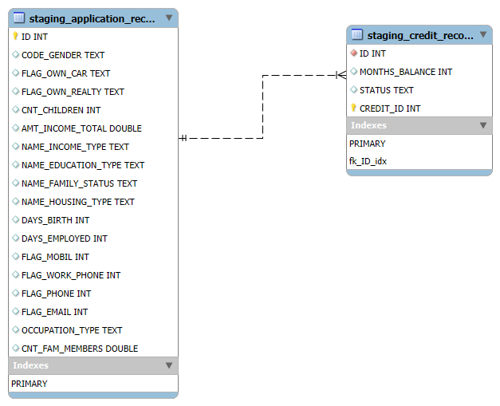
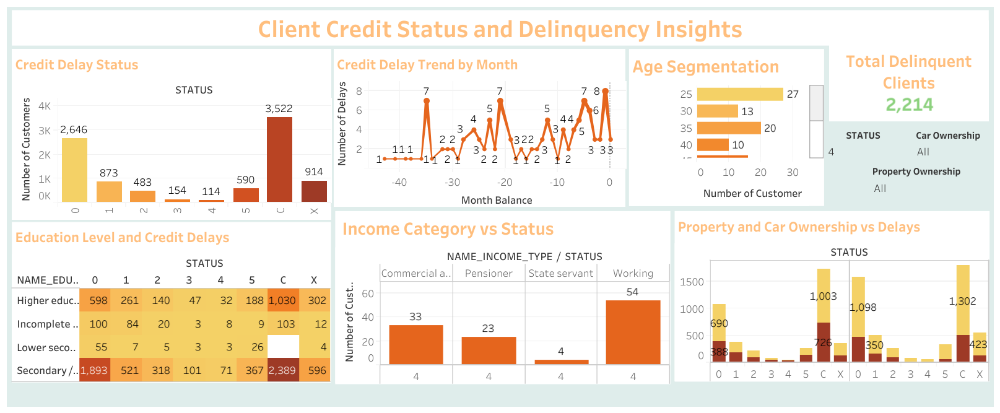

# Client Credit Status and Delinquency Insights (SQL & Tableau)

## Client Credit Status and Delinquency Insights

### Executive Summary

This project focuses on analyzing client credit status and delinquency to provide actionable insights for financial institutions. By leveraging a comprehensive dataset of client applications and payment history, we performed data cleaning, exploratory data analysis (EDA), and visualized key metrics using SQL and Tableau. These insights aim to improve credit risk assessment, optimize lending strategies, and enhance customer relationship management. Key findings include patterns in overdue payments, client demographics affecting delays, and the impact of income levels and property ownership on delinquency. This analysis empowers stakeholders to make informed decisions regarding credit risk management.

## Business Problem

Financial institutions often struggle with assessing creditworthiness and managing the risk of delinquency. Inaccurate assessments can lead to financial losses or missed opportunities. This project aims to provide valuable insights into client credit applications and past delinquency records to enhance the credit approval process, mitigate risks, and improve loan recovery strategies. By identifying trends in overdue payments and analyzing client attributes, financial institutions can better tailor their credit policies and interventions.

## Entity-Relationship Diagram (ERD)

## Data Cleaning

1. **Database and Table Creation**: 
   Two main tables, `application_record` and `credit_record`, were created to store customer data and credit history.

2. **Staging Table Creation**: 
   Temporary staging tables were created for processing data to ensure original data remains intact during cleaning operations.

3. **Primary Key Addition**: 
   A primary key (`credit_id`) was added to the `staging_credit_record` table for data integrity and consistency.

4. **Duplicate Removal**: 
   Duplicates in the `staging_application_record` table were identified and removed.

5. **STATUS Column Cleaning**: 
   The `STATUS` column in the `staging_credit_record` table was cleaned by standardizing values and removing hidden characters.

6. **Handling Null Values**: 
   Null values in the `OCCUPATION_TYPE` column were replaced with a default value, ensuring no missing data impacts the analysis.

7. **Final Data Review**: 
   A final review of the cleaned data was conducted to confirm the success of all operations.

## Data Analysis

1. **Client Demographics**: 
   Analysis of client demographic factors such as income, age, education level, and family status provided insights into patterns of credit delay.

2. **Credit Behavior and Delinquency**: 
   Delinquency status was analyzed across several factors, including car ownership, property ownership, and occupation type, to understand the drivers of overdue payments.

3. **Income and Delays**: 
   Income levels were cross-referenced with delinquency status to highlight groups that are more likely to face credit delays.

4. **Loan Payment Trends**: 
   Payment trends were analyzed over time to identify periods of increased financial strain.

## Tableau Dashboard Overview

1. **Credit Delay Status**: 
   A bar chart displaying the distribution of customers across different credit delay statuses.

2. **Credit Delay Trend by Month**: 
   A line graph showing fluctuations in credit delays over time, identifying potential periods of financial stress.

3. **Age Segmentation**: 
   A chart breaking down credit delays by age group to uncover age-specific delinquency trends.

4. **Education and Credit Delays**: 
   A heatmap visualizing the relationship between education levels and credit delays.

5. **Income Category vs Delays**: 
   A chart comparing credit delays by different income categories.

6. **Property and Car Ownership vs Delays**: 
   A stacked bar chart showing the correlation between property and car ownership with credit delays.

## Business Recommendations

Based on the analysis of client credit status and delinquency patterns, the following recommendations are proposed to improve credit risk management and enhance decision-making processes for financial institutions:

### Targeted Risk Assessment
- **Age and Education**: Clients within certain age groups and with lower education levels exhibit higher delinquency rates. Financial institutions should consider applying stricter risk assessment criteria or offering tailored credit products to these segments.
- **Income Categories**: Clients with lower or inconsistent income sources, such as self-employed individuals or those working in precarious jobs, are more prone to overdue payments. It is advisable to adopt differentiated interest rates or more thorough income verifications for these groups.

### Customizable Credit Policies
- **Property and Car Ownership**: Analysis shows that clients owning both cars and properties tend to face more delays in payments. Financial institutions could consider revisiting the credit scoring model to factor in these financial strains and offer more flexible repayment terms to clients with high asset ownership.

### Proactive Credit Management
- **Monitoring Delinquency Trends**: The analysis highlights specific months where delinquency spikes. Financial institutions should consider strengthening credit monitoring systems during these periods and implementing timely interventions, such as reminders or payment restructuring offers, to prevent loan defaults.
- **Customer Segmentation for Credit Products**: By segmenting customers based on demographics like education, age, and income, institutions can design more personalized credit products that align with clients' financial capabilities, reducing the likelihood of overdue payments.

### Enhance Loan Recovery Strategies
- **High-Risk Groups**: Clients with prolonged overdue payments (status '5') should be flagged for immediate loan recovery actions. Offering these clients debt restructuring or alternative payment plans may help improve recovery rates.
- **Pre-Delinquency Interventions**: Clients exhibiting early signs of financial distress (status '1' or '2') should be identified and targeted with intervention strategies, such as offering grace periods or temporary payment reductions to avoid further delays.

### Strengthen Financial Literacy Initiatives
- **Education Correlation with Delinquency**: Clients with secondary education tend to have higher delinquency rates. Offering financial literacy programs to such groups, aimed at improving their credit management skills, can help reduce default risks in the long term.
   
## Next Steps

- **Machine Learning Models**: 
   Implement predictive models such as Logistic Regression and Random Forest to forecast credit delinquency.
  
- **Feature Engineering**: 
   Enhance the dataset by integrating additional data sources like credit scores to improve predictions.
  
- **Real-Time Monitoring**: 
   Develop a real-time dashboard for proactive credit risk monitoring.

